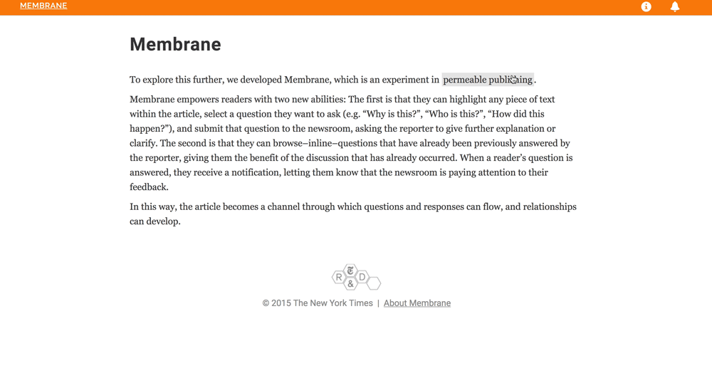

# An experiment in permeable publishing.



Jane Friedhoff's fork of Membrane. Read more [here](http://janefriedhoff.com/notepad/update/2017/06/05/membrane.html).

You need [Go](https://golang.org/doc/install), [Mongo](https://docs.mongodb.com/manual/installation/), and [Mercurial](https://www.mercurial-scm.org/wiki/Download) to run Membrane. [Postman](https://chrome.google.com/webstore/detail/postman/fhbjgbiflinjbdggehcddcbncdddomop?hl=en) is helpful for posting to various endpoints.

How to start it up:

* Start up Mongo: ```mongod --dbpath /your/path/to/membrane/data``` 
* Put membrane in your gopath
* ```go get .```
* ```go build && ./membrane```
* Create a user account for yourself: POST to the `/register` endpoint, e.g. 
```
   {
    "username" : "jane",
    "password" : "sosecure"
   }
```
* Create a promptset for yourself: POST to the `/promptsets` endpoint, e.g. 
```
	{
	    "parent":"jane",
	    "prompts": [
	        "why",
	        "help"
	    ]
	}
```
* Log in: go to `/login` and type in your username and password
* Write your initial text: you should be redirected to `/initial`, which is where you'll post your first text
* Go to `/{yourslug}` to see your initial text--try highlighting a piece and selecting a question from the dropdown
* Go to `/admin/{yourslug}` to see and answer questions asked about your text
* Go back to `/{yourslug}` to see your answer highlighted on the frontend


# Current API endpoints

Please check out [current endpoints](/API_ENDPOINTS.md).


# Current framework thoughts:

The goal of this project is to explore what it looks like when a webpage or digital publishing platform is given the affordances of the medium: namely, the ability to edit things live/on the fly, receive prompts from people as they read it, and in general create a more fluid/weird power relationship between creator and consumer.

The system is broken down into two pieces: responses and prompts.

A ***response*** is any asset generated by the owner of the platform/site. That could be the core asset, or it could be any asset generated subsequently (e.g. something they write based on a prompt they get).

A ***prompt*** is any piece of feedback coming from the user. At the moment, users create prompts by highlighting text, choosing the way they want the author to respond, and submitting that.

By treating all assets generated by the creator as a response, it means we can allow consumers to do things like mark up a response replying to a prompt with more prompts, allowing consumers to wander down through the branches of an asset.